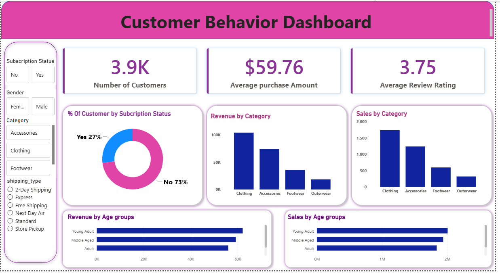

<<<<<<< HEAD
# 📊 Customer Behavior Analysis using SQL & Power BI


---

# 📌 Project Overview

This project analyzes **customer shopping behavior** using **SQL queries and Power BI dashboards**.

The main goal of this project is to understand:

- Customer purchase patterns  
- Product popularity  
- Impact of discounts on purchasing behavior  
- Subscription behavior  
- Revenue contribution from different customer groups  

Using **SQL analysis and Power BI visualization**, this project converts raw customer transaction data into **valuable business insights** that can help businesses improve marketing strategies and customer engagement.

---

# 🎯 Objectives

The key objectives of this project are:

- Analyze customer purchasing behavior  
- Identify top-performing products  
- Study the effect of discounts on purchases  
- Compare subscriber vs non-subscriber spending  
- Segment customers based on purchase frequency  
- Build interactive dashboards using Power BI  

---

# 📂 Dataset Description

The dataset contains customer shopping behavior information.

| Column | Description |
|------|-------------|
| Customer ID | Unique identifier for each customer |
| Age | Age of the customer |
| Gender | Male or Female |
| Item Purchased | Product purchased |
| Category | Product category |
| Purchase Amount (USD) | Amount spent |
| Review Rating | Customer rating |
| Subscription Status | Yes / No |
| Discount Applied | Discount used |
| Shipping Type | Standard / Express |
| Previous Purchases | Number of previous purchases |

This dataset enables analysis of:

- Customer segmentation  
- Product popularity  
- Discount usage patterns  
- Revenue distribution across demographics  

---

# 🛠 Tools & Technologies

The project uses the following technologies:

- **SQL (PostgreSQL / MySQL)**  
- **Python**  
- **Jupyter Notebook**  
- **Power BI**  
- **GitHub**

---

# 📁 Project Structure


```
customer-behavior-analysis

│
├── data
│   └── customer_shopping_behavior.csv
│
├── sql
│   └── analysis_queries.sql
│
├── notebook
│   └── analysis.ipynb
│
├── dashboard
│   └── powerbi_dashboard.pbix
│
├── documentation
│   └── project_report.docx
│
└── README.md
```

---


---

# 📊 Power BI Dashboard

The Power BI dashboard provides interactive insights into customer shopping behavior.



### Dashboard Highlights

- **3.9K Total Customers**
- **$59.76 Average Purchase Amount**
- **3.75 Average Review Rating**

The dashboard visualizes:

- Revenue by product category
- Sales distribution across categories
- Customer segmentation
- Revenue by age groups
- Subscription behavior

---

# 🧠 SQL Analysis

Below are key SQL queries used to analyze the dataset.

---

## 1️⃣ Total Revenue by Gender

```sql
SELECT gender,
       SUM(purchase_amount) AS total_revenue
FROM customer
GROUP BY gender;
---

## 2️⃣ Customers Using Discount but Spending Above Average

```sql
SELECT customer_id,
       purchase_amount
FROM customer
WHERE discount_applied = 'Yes'
AND purchase_amount >
      (SELECT AVG(purchase_amount) FROM customer);
```

---

## 3️⃣ Top 5 Products by Review Rating

```sql
SELECT item_purchased,
       AVG(review_rating) AS avg_rating
FROM customer
GROUP BY item_purchased
ORDER BY avg_rating DESC
LIMIT 5;
```

---

## 4️⃣ Average Purchase by Shipping Type

```sql
SELECT shipping_type,
       AVG(purchase_amount) AS avg_purchase
FROM customer
GROUP BY shipping_type;
```

---

## 5️⃣ Subscriber vs Non-Subscriber Spending

```sql
SELECT subscription_status,
       AVG(purchase_amount) AS avg_spend,
       SUM(purchase_amount) AS total_revenue
FROM customer
GROUP BY subscription_status;
```

---

## 6️⃣ Products with Highest Discount Usage

```sql
SELECT item_purchased,
       (SUM(CASE WHEN discount_applied='Yes' THEN 1 ELSE 0 END)*100.0)/COUNT(*) 
       AS discount_percentage
FROM customer
GROUP BY item_purchased
ORDER BY discount_percentage DESC
LIMIT 5;
```

---

## 7️⃣ Customer Segmentation

```sql
SELECT
CASE
    WHEN previous_purchases <= 1 THEN 'New'
    WHEN previous_purchases <= 5 THEN 'Returning'
    ELSE 'Loyal'
END AS customer_segment,
COUNT(*) AS customer_count
FROM customer
GROUP BY customer_segment;
```

Customers are classified as:

- **New Customers**
- **Returning Customers**
- **Loyal Customers**

---

## 8️⃣ Top 3 Products within Each Category

```sql
SELECT *
FROM (
    SELECT category,
           item_purchased,
           COUNT(*) AS purchases,
           ROW_NUMBER() OVER(
                PARTITION BY category
                ORDER BY COUNT(*) DESC
           ) AS rank
    FROM customer
    GROUP BY category,item_purchased
) t
WHERE rank <= 3;
```

---

## 9️⃣ Repeat Buyers and Subscription

```sql
SELECT subscription_status,
       COUNT(*)
FROM customer
WHERE previous_purchases > 5
GROUP BY subscription_status;
```

---

## 🔟 Revenue Contribution by Age Group

```sql
SELECT age_group,
       SUM(purchase_amount) AS revenue
FROM customer
GROUP BY age_group;
```

---

#  Key Insights

From the analysis we observe:

- Clothing category generates **highest revenue**
- Younger customers contribute **largest purchase volume**
- **Discount usage increases purchasing frequency**
- **Loyal customers generate the majority of revenue**
- Subscribers tend to **spend slightly more**

---

#  Future Improvements

Possible improvements for this project:

- Machine learning customer segmentation  
- Product recommendation system  
- Predictive sales analytics  
- Real-time business dashboards  

---

#  Author

**Gyanendra Kumar**

Data Analytics Student

---

#  Support

If you found this project useful, please give it a **star ⭐ on GitHub**.
=======
# customer-behavior-analysis-sql-powerbi
Customer behavior analysis using SQL and Power BI to explore purchasing patterns, product performance, and revenue insights through an interactive dashboard.
>>>>>>> c004ec77a1ca1500ace22a2fa8bd8a38190c0619
